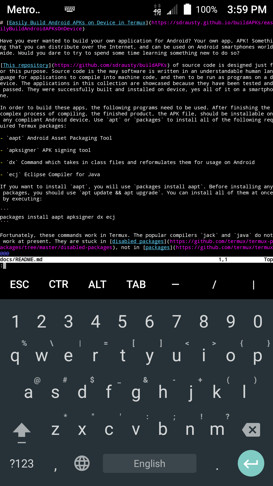

# [Easily Build Android APKs on Device in Termux](https://BuildAPKs.github.io/docsBuildAPKs/easilyBuildAndroidAPKsOnDevice)

Have you ever wanted to build your own application for Android on Android? Your own app, APK! Something that you can distribute over the Internet, and can be used on Android smartphones worldwide. Would you dare to try to spend some time learning something new to do so?

[This repository](https://github.com/BuildAPKs/buildAPKs) of source code is designed just for this purpose. Source code is the way software is written in an understandable human language for applications to compile into machine code, and then to be run as programs on a device. The applications in this collection are showcased because they have been tested and passed. They were successfully built and installed on device, yes all of it on a smartphone.

In order to build these apps, the following programs need to be used. After finishing the complex process of compiling, the finished product, the APK file, should be installable on any compliant Android device. Use `apt` or `packages` to install all of the following required Termux packages:

- `aapt` Android Asset Packaging Tool

- `apksigner` APK signing tool

- `dx` Command which takes in class files and reformulates them for usage on Android

- `ecj` Eclipse Compiler for Java

If you want to install `aapt`, you will use `packages install aapt`. Before installing any packages, you should use `apt update && apt upgrade`. You can install all of them at once by executing:

```
packages install aapt apksigner dx ecj
```

Fortunately, these commands work in Termux. The popular compilers `jack` and `java` do not work at present. They are stuck in [disabled packages](https://github.com/termux/termux-packages/tree/master/disabled-packages), not in [packages](https://github.com/termux/termux-packages/tree/master/packages) that you can install on the fly. There is active discussion regarding why `jack` is stuck [here](https://github.com/termux/termux-packages/issues?utf8=✓&q=is%3Aissue%20%20jack), and why `java` is stranded [there.](https://github.com/termux/termux-packages/issues?utf8=✓&q=is%3Aissue%20%20java)

You may be wondering now after installing the necessary packages and downloading the source code:

```
cd && git clone https://github.com/BuildAPKs/buildAPKs
```

What do I do next? How do I use `aapt`, the Android Asset Packaging Tool; `apksigner`, the APK signing tool; `dx`, the command which takes in class files and reformulates them for usage on Android, and `ecj`, the Eclipse Compiler for Java?

[This project](https://github.com/BuildAPKs/buildAPKs) has [bash scripts](https://github.com/BuildAPKs/buildAPKs/tree/master/scripts/build) which help immensely in automating work. Make them executable by `chmod 750 script_name` if they are not already. Check to see their permissions with `ls -al`. Then simply run `build.one.bash` in the directory of the program you wish to make by calling it by name. Look for the `AndroidManifest.xml` file. That is where you want to run the [build.one.bash script.](https://raw.githubusercontent.com/BuildAPKs/buildAPKs/master/scripts/bash/build/build.one.bash) After you are done building the app, install it **from** your `/sdcard/Download/builtAPKs` directory through your file manager in Android.

If your system does not have a file manager, Open File Manager is available at [F-droid.](https://f-droid.org/packages/com.nexes.manager/) You can download, install and use it. Source code for this APK (Android Package Kit) is available [here](https://github.com/BuildAPKs/buildAPKsApps/tree/master/browsers/Android-File-Manager) at buildAPKsApps, a submodule of buildAPKs. If you prefer [Ghost Commander,](https://f-droid.org/packages/com.ghostsq.commander/) the souce code is available [here.](https://github.com/BuildAPKs/buildAPKsBrowsers/tree/master/ghostcommander-code) Both APKs build beautifully on device (a smartphone) in your pocket with [Termux.](https://termux.com) We should really leave the age of whirling fans and disk drives behind.

Enjoy this project! Inscribe your feedback at either the [wiki,](https://github.com/BuildAPKs/buildAPKs/wiki) the [issues pages](https://github.com/BuildAPKs/buildAPKs/issues) or through [the code itself.](https://github.com/BuildAPKs/buildAPKs/pulls) 

#### When you press and momentarily hold the `volumeDown+power` buttons simultaneously on a smartphone, it takes a screenshot much like this one which shows the screen and the [the source code for this page](https://raw.githubusercontent.com/BuildAPKs/buildAPKs/master/docs/README.md) in [vim](http://www.vim.org/git.php) running on [Termux](./pages/asac) on [Android.](https://source.android.com/)



#### This animation was created with [imagemagick](https://sdrausty.github.io/pages/im.html) in [Termux](https://sdrausty.github.io/pages/asac.html) on an Android smartphone.


If you're confused by this page try [this link,](http://tldp.org/) or you might want to try [this one.](https://www.debian.org/doc/) Post your what you have found at [the wiki,](https://github.com/sdrausty/buildAPKs/wiki) [donate](https://sdrausty.github.io/pages/donate) and help [this website grow!](https://sdrausty.github.io/)

- [Termux on F-droid!](https://f-droid.org/packages/com.termux/) Please do not mix your installation of Termux between Google Play and F-droid. There are [compatibility issues.](https://github.com/termux/termux-api/issues/53)

[Up One Level](./../)

🛳⛴🛥🚢🚤🚣⛵


Message to https://github.com/Grimler91 I have stepped on the ancient cobblestones in the capital, north of Stockholm. You enticed me to contribute. Then you, with others, deleted my hard effort, my work numerous times before I became aware of your destructive actions towards Termux development. Later you banned my account from Termux. @Grimler91, you and your team are keeping Termux away from Wikipedia, and guess what, I know why. You wanna my latex academic literature, and my smartphone bitcoins, Swedish liaison! My academic literature is not to be stolen/deleted by you and your Termuxed deb packages!

Message to https://github.com/fornwall DITTO. Do you like being the stooge? Too lazy to merge pull requests? Or is it, no ones rooted, and I cannot get the bitcoins and bounce a Tesla autodrive?

Message to https://github.com/Neo-Oli DITTO without Sweden encouraging me to root my stuff, just you and your team encouraging me to root away my Android citadel from Switzerland!

Message to https://github.com/xeffyr DITTO without Sweden encouraging me to root my stuff, just you and your group encouraging me to root away my Android castle from the Ukraine!

Did you wanna root my device to getta my BITCOINS, my Tesla autodrive? @Grimler91 BITCOINS+literature? You know, latex is elastic. Read my work through your Termuxed latex *.deb? I think not @Grimler91. Neo-Oli the Swiss banker, can you please confirm? Or are you and your team camping far away from us in the Alpine Mountains with other people's bitcoins?

You didn't like the timings, did you? I did not like them at all. Why is Termux slower? Degustamos rooted bitcoins?

Listen; https://github.com/sdrausty/sdrausty.github.io/blob/master/audio/alphaV.webm?raw=true Possibly you shall comprehend. Possibly.

You are welcome to reply to my public statement. As you know, I have been using Termux software since it arrived. After years of using (coof coof) your open source software (does it compile?) I have a firm opinion about you. If it doesn't compile, what are you feeding me? Why are you wasting my time? To get my autodrive, my bitcoins? Why doesn't it compile from the source code that you publish?
